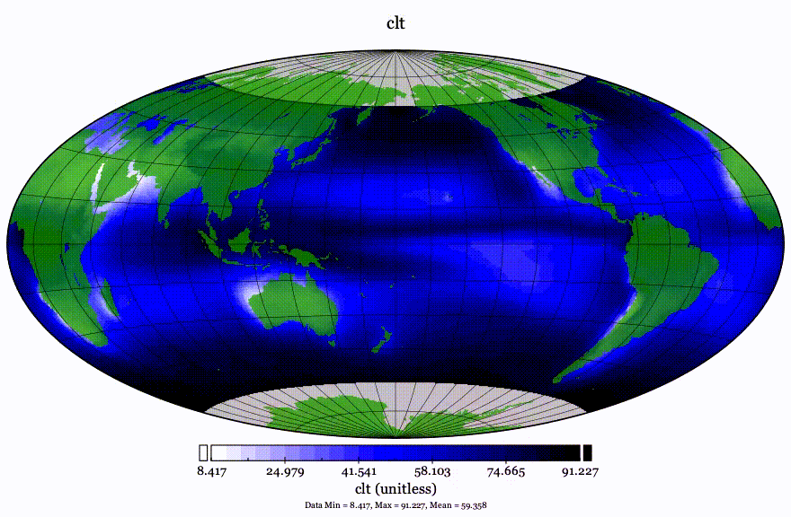
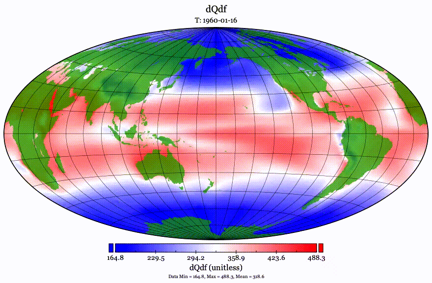
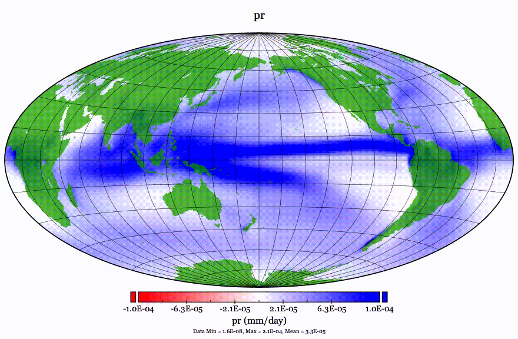
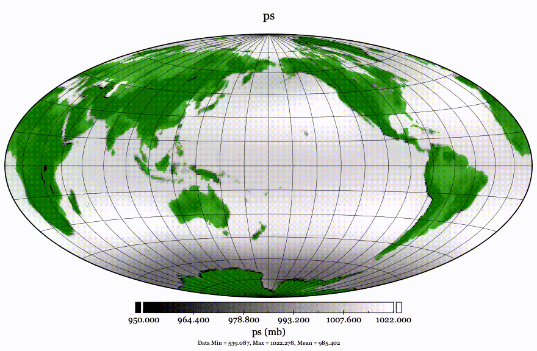
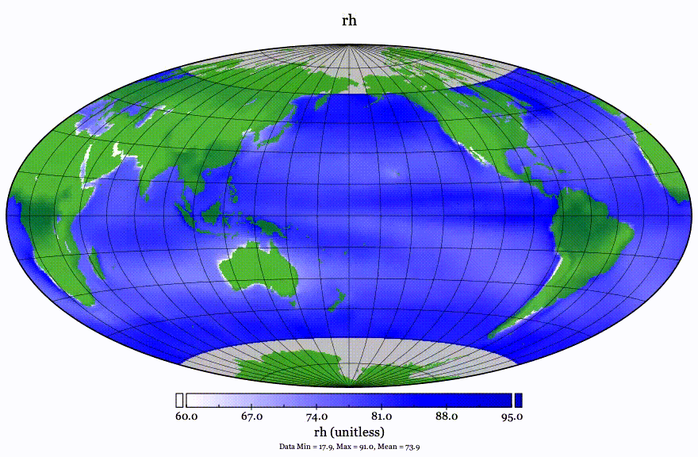
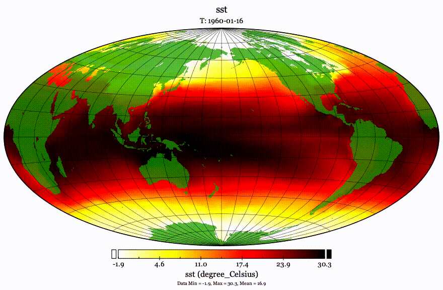
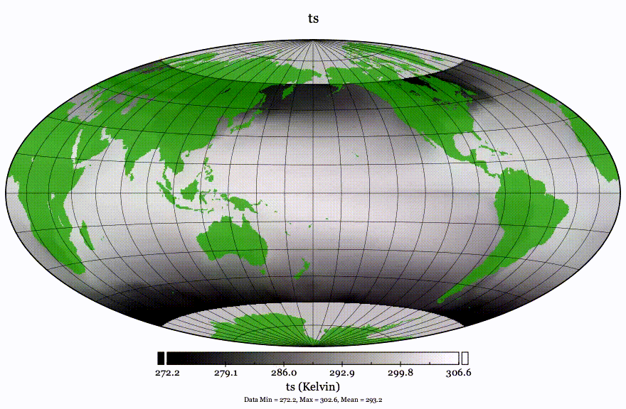

# seager19
<a href="https://opensource.org/licenses/MIT"></a>
 <a href="https://github.com/psf/black"></a>
<a href='https://seager19.readthedocs.io/en/latest/?badge=latest'>
    
</a>


## Purpose

A repository to contain and analyse the code from:

_Seager et al. 2019, Nature Climate Change, Strengthening Tropical Pacific Zonal Sea Surface Temperature Gradient Consistent with Rising Greenhouse Gases_

<https://doi.org/10.1038/s41558-019-0505-x>


### Summary of paper:

- There is a west-east warm-to-cold contrast in the Pacific.

- GCMs predict weakening contrast with GHG conc.

- In observations it has increased.

- Their cleverer simple linear model agrees with observations.

### Citation:

The citation for this paper is:

```
@article{seager2019strengthening,
  title={Strengthening tropical Pacific zonal sea surface temperature gradient consistent with rising greenhouse gases},
  author={Seager, Richard and Cane, Mark and Henderson, Naomi and Lee, Dong-Eun and Abernathey, Ryan and Zhang, Honghai},
  journal={Nature Climate Change},
  volume={9},
  number={7},
  pages={517--522},
  year={2019},
  url={https://doi.org/10.1038/s41558-019-0505-x},
  publisher={Nature Publishing Group}
}
```
### Podcast:

The paper is discussed in a podcast available at:

<https://deep-convection.org/2020/04/13/episode-5-richard-seager/>


## Code
The code and data was taken from:

<http://kage.ldeo.columbia.edu:81/SOURCES/.LDEO/.ClimateGroup/.PROJECTS/.PublicationsData/.Seager_etal_NCC-2019/>

The Python code for the atmosphere model is in a Juypter Notebook. The ocean model code is built on legacy Fortran 90 and C code.

The data is currently not stored in the github repository, as it takes up roughly 3.5 GB.

### Code Makeup


From running the command

      cloc $(git ls-files)


The initial state off the code was:

      48 text files.
      45 unique files.                              
      14 files ignored.

github.com/AlDanial/cloc v 1.84  T=0.10 s (349.4 files/s, 149217.5 lines/s)

 | Language                |       files       |     blank      |    comment      |       code | 
 | ----------------------- | ----------------- | -------------- | --------------- | ---------- | 
 | Fortran 77              |          15       |      1364      |       1365      |       6170 | 
 | C                       |           5       |       493      |        200      |       2746 | 
 | Jupyter Notebook        |           2       |         0      |        517      |        474 | 
 | Python                  |           2       |       172      |        100      |        397 | 
 | C/C++ Header            |           8       |        88      |         18      |        365 | 
 | make                    |           1       |        15      |          1      |         36 | 
 | Markdown                |           1       |         0      |          0      |          1 | 
 | SUM:                    |          34       |      2132      |       2201      |      10189 | 


### Code structure 

The code is structured into folders:

```
   |-animations
   |-atmos
   |---README.md --> lists file structure of this model.
   |---DATA
   |---tmp
   |-ocean
   |---README.md --> lists file structure of this model.
   |---DATA
   |---RUN
   |-----run-model --> run this with bash to run model?
   |-----DATA
   |-----output
   |---SRC
   |-----DATA
   |-----output
   |-requirements
```

## Model from the Methods Appendix to Seager et al. 2019

### Atmos and Ocean reanalysis

- ECMWF ERA-40 1958-78 & ERA-Interim 1979-2017
  - Wind at 2m from surface, 
  - precipitation, 
- ORAS4 1958-2017
  - SST, 
  - themocline depth (20C isotherm).
















### Atmospheric Model

  (u, v, w) = (u'cos(pi z/zT), v'cos(pi z/zT), w'sin(pi z/zT))

z is the height, and zT is the top of the troposphere.

  (theta, Q) = (theta', Q')(theta0/theta00) sin(pi z/zT)

  p = p'(rho0 / rho00) cos(pi z/zT)

  (p/rho0)_z = g theta / theta00

  p'/rho00 = (g zT/ pi theta00)theta'


theta0 and rho0 are basic-state potential temperature and density profiles.

  epsilon_u u - fv + phi_x = 0
  epsilon_v v + fu + phi_y = 0
  epsilon_phi phi + u_x + v_y = -Q_1

the geopotential:

  phi = - (g zT/ pi theta_00) theta

### Ocean Model

## Videos of outputs:

### ocean-model/RUN/output/

 * SST_SST full in om_run2f: <https://youtu.be/JA97IWPmwxs>
 * DYN_PRES in om_run2f: <https://youtu.be/5oRMWWAK1sM>
 * TDEEP_HMODEL in om_run2f: <https://youtu.be/n25l6uYWEzY>
 * TDEEP_HTHERM in om_run2f: <https://youtu.be/ikOo6VTXfkg>
 * TDEEP_TDEEP in om_run2f: <https://youtu.be/BSRyTuESzLA>
