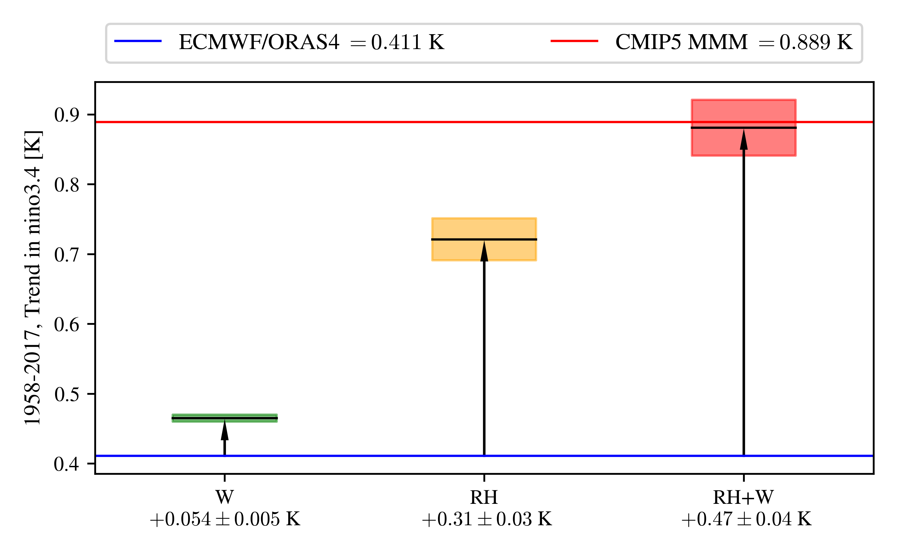
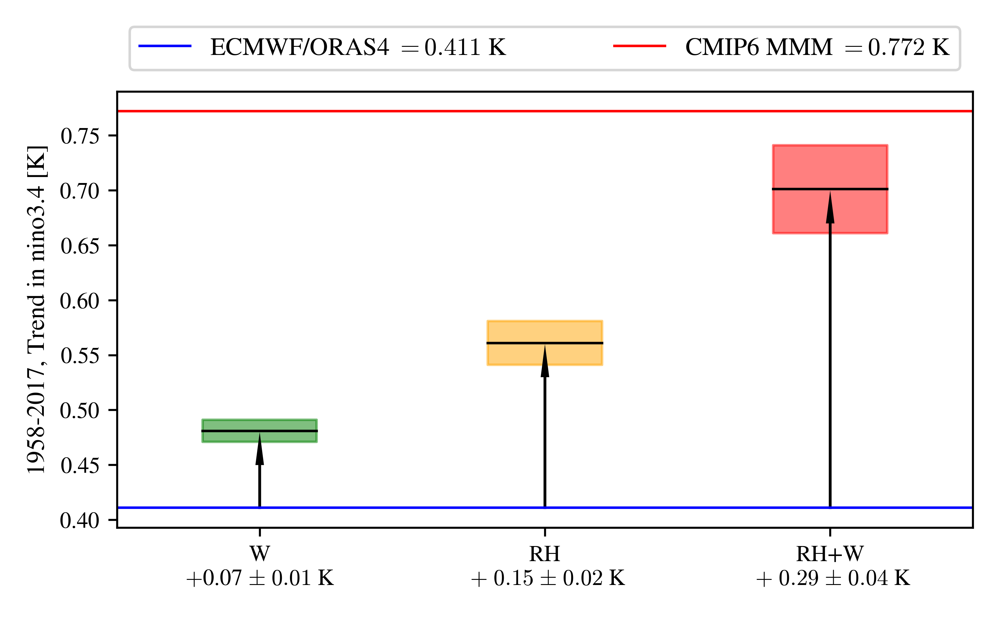
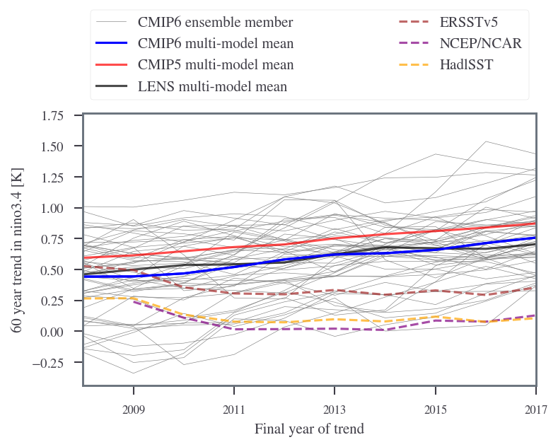

.. src documentation master file.
   You can adapt this file completely to your liking, but it should at least
   contain the root `toctree` directive.

A Parsimonious Coupled Model of the Equatorial Pacific Surface Temperature Change
=============================================================================================

Welcome to the seager19 replication documentation!

This project reassembles a parsimonious coupled model of the equatorial Pacific,
from `Seager et al. 2019 (S19)`_, which they created to explain the bias in the
trend in NINO3.4 temperature in CMIP5 models. When forced with ECMWF reanalysis 
fields, it can reproduce the trend observed in ECMWF/ORAS4 that was forced with the 
same fields. It shows that the CMIP5 bias in the trend in NINO3.4 from 1958-2017 could
be due to a product of the CMIP5 bias in relative humidity and sea surface winds.
This is shown through exchanging ECMWF mean fields for CMIP5 multimodel mean fields.
The replacements of mean relative humidity, mean wind speed, and both together,
lead to increases in the NINO3.4 trend of 0.31±0.03 K, 0.054±0.005 K, and 0.47±0.04 K,
respectively. The error bars are from tests with a range of plausible inputs. This is
congruent with the difference of 0.478 K between the ECMWF/ORAS4 reanalysis product
and the CMIP5 multimodel mean. I investigate how reliable the results from this model
might be by varying the free parameters and find that, as far as tested, the model is
not overly sensitive to subjective inputs.

It is therefore plausible that the observed bias in the increase in sea surface
temperature in the nino3.4 region is caused by excess humidity, and insufficient
tropical windspeeds in the mean climatological state. This appears to be largely 
produced through more humidity and less wind reducing the sensitivity of the surface
latent heat flux to increased temperature. Therefore, the relative humidity and 
windspeed bias from the mean state of the surface atmosphere makes the central and 
east equatorial Pacific seem to be easier to warm than it is.

This model does not explain why these surface atmosphere biases occur in the first place.
For that, we would need to consider the much more complicated processes that are important 
in the tropical atmosphere, that are connected to the "Double ITCZ Cold Tongue Bias" which
has been observed in each subsequent generation of complicated climate models. The model
explains that a bias in the mean state of CMIP5/6 propagates into a bias in the sensitivity
of CMIP5/6 to forcing, not why this bias in the mean state exists.

The nino3.4 trend bias would probably introduce a nonstationary bias in the various hazards
in CMIP5/6 that have a teleconnection to El Nino Southern Oscillation. For example, more 
tropical cyclones form in the North Atlantic when there is La Nina, due to reduced shear 
(e.g. `Camargo, Emanuel and Sobel 2007`_). Therefore, the nino3.4 trend bias would
lead to an underprediction in the apparent risk from tropical cyclones for the
North American East coast in the future projections from CMIP5/6.

  
  Replacing the climatological wind (W) and relative humidity (RH) with CMIP5 
  multimodel mean explains the bias in CMIP5 nino3.4 trend. The error envelope 
  plotted is the range calculated from the possible parameter settings from either
  the paper, the figure data, or the original version of uncoupled code. The raw 
  data is provided in this `spread sheet`_.

See :download:`the final report <Report_without_documentation.pdf>` 
for more details and tests.

CMIP6 seems to have a smaller bias (at least from the 51 ensemble member that I
collected from Pangeo). However, it seems that this bias is not as small as our 
model would predict. The mean relative humidity and wind speed fields seem to 
have improved more between the two models than the trend in nino3.4.

  
  Replacing the climatological wind (W) and relative humidity (RH) with CMIP6 
  mean explains only the majority of the bias in CMIP6 nino3.4 trend. The errors
  are calculated as in the previous plot. This could either suggest that other
  mechanisms are becoming important in CMIP6, or that this simplified model's
  parameters were tuned to explain the CMIP5 bias rather than CMIP6.

  
  The trend is calculated over 60 years, defined as the change that would be
  calculated that a linear regression fitted on the time series would predict
  over that period. This is done so that higher frequency changes are damped out
  to some extent. The end year of the trend is varied to test that the bias is
  robust to the placement of El Nino / La Nina events. CMIP6-MMM seems to be
  robustly lower than CMIP5-MMM, suggesting that the models have improved somewhat.
  The observational reanalysis products (dashed lines) show a lower trend than the
  models, particularly for the last few years plotted. The members of the CMIP6
  ensemble could be taken to describe the probability of any trend given the models.
  Based on this the later years of the trend in the observational data would be
  very unlikely given the models, and this would suggest that the models probably
  have some significant bias.

The first section `seager19` contains the main `README.md` of the repository.
This should provide a reasonable introduction to the repository as a whole.

Here is the current breakdown of the model code by language:

.. code-block:: bash

   $ cloc --report-file=docs/lang.txt  $(git ls-files)

.. include:: lang.txt
   :literal:

MRes Proposal:

.. figure:: gifs/trend_graph.png
  :width: 500
  :alt: trend graph
  :align: center

  Figure 1e from S19.
  The observations (reanalysis products) are marked as orange diamonds / blue crosses / red star;
  the models are marked as blue / black dots, with multimodel mean as corresponding diamonds. 
  The CMIP ensemble members show little overlap with any of the reanalysis products.
  This suggests that the data is very unlikely given the model, and therefore a systematic
  bias in the CMIP5/LENS models.

Seager et al. 2019 [1, hereafter S19] showed that although CMIP5 ensemble members 
have a positive NINO3.4 trend (towards El Nino) where as the observations show a
more negative NINO3.4 trend (towards La Nina).

.. figure:: gifs/trend_graphic.png
  :width: 500
  :alt: trend graphic
  :align: center

  A diagram to illustrate the consequences that this has. S19 suggests an over all
  tendency to La Nina in observations rather than El Nino.

They showed that the observed trend can be reproduced with a simple coupled physical
model. Here, we carry out a parameter sensitivity analysis of the S19 model.
Of particular interest might be the S19 model's sensitivity to the drag coefficient,
as S19 note that they chose a much higher value than normal so as to replicate the
amplitude of ENSO. This sensitivity analysis could first be achieved using a
Gaussian Process (GP) with a radial basis function (RBF) kernel of a given
smoothness, as the number of data points will initially be quite small (<10^{4}).
S19 is computationally lightweight, allowing for a large number of parallel
sensitivity experiments to be run at the same time in order to generate the
training dataset for the GP model. The GP model will allow us to rapidly explore
the parameter space in between our chosen parameter configurations, in terms
of both the mean value and uncertainties. From this initial baseline, we could
expand to more sophisticated sensitivity analyses, and/or more complicated
model settings.

.. figure:: gifs/om_diag_SST_SST.gif
  :width: 500
  :alt: SST in diag period 1956-58
  :align: center
  
  The sea surface temperature (SST) for the whole model region between 1956-58.
  The output of this step of the model is the heat flux correction factor that feeds
  into the rest of the model. The resolution of the model is 1 degree, and the grid
  rectilinear. The model is makes the beta plane approximation evaluated at the equator,
  and so the results are would only be realistic near the equator. It takes climatological
  inputs for sea surface temperature and wind stress from ECMWF.

Scientific questions to be addressed include:

- Can we replicate the results displayed in S19? [mostly]
- How robust is the model to the parameters chosen? [fairly]
- Can the sensitivity of the model to the parameters be understood
  from the physical processes underlying it? [partially]
- How skillful are different emulation functions at
  fitting input/output of the model? [untested]

Citations:

[1] Seager, R. et al. Strengthening tropical Pacific zonal sea surface temperature gradient consistent with rising greenhouse gases, https://doi.org/10.1038/s41558-019-0505-x (July 2019.)

[2] Tian, B. & Dong, X. The Double-ITCZ Bias in CMIP3, CMIP5, and CMIP6 Models Based on Annual Mean Precipitation. Geophysical Research Letters 47, e2020GL087232. issn: 0094-8276. doi:10.1029/2020GL087232. https://onlinelibrary.wiley.com/doi/abs/10.1029/2020GL087232 (Apr. 2020).

.. toctree::
   :maxdepth: 3
   :caption: Contents:

   self
   MAIN_README.md
   src
   OCEAN_README.md
   gallery.md
   tutorials
   about

Indices and tables
==================

* :ref:`genindex`
* :ref:`modindex`
* :ref:`search`

.. _Seager et al. 2019 (S19): https://doi.org/10.1038/s41558-019-0505-x
.. _Camargo, Emanuel and Sobel 2007: https://www.ldeo.columbia.edu/~suzana/papers/camargo_emanuel_sobel_jclim07.pdf
.. _spread sheet: https://docs.google.com/spreadsheets/d/1QrCLil7uHMRJECOoSL18uk2mvBwMLxqesXbZpUWh3ko/edit?usp=sharing
